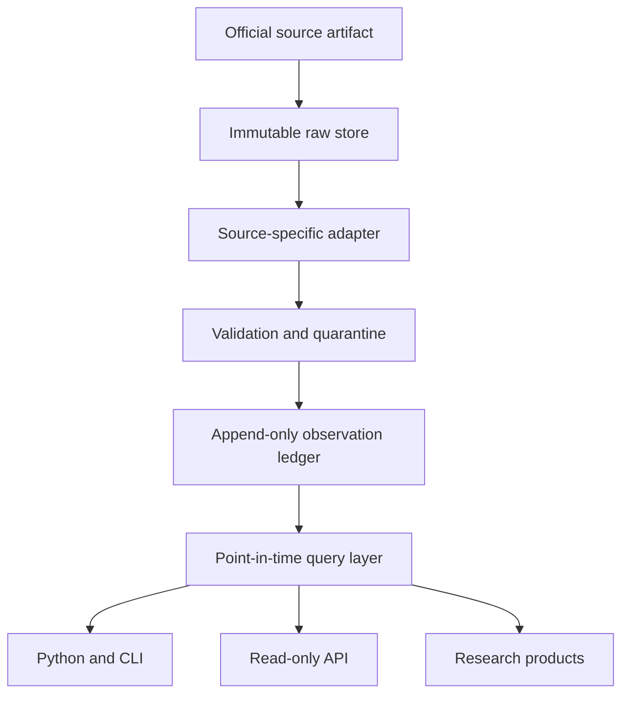

# Architecture

## System boundary

The Terminal is a provenance ledger and query layer. Dashboards, papers and models are downstream consumers. They do not own canonical data and may not overwrite it.

## Layers

1. **Raw:** byte-for-byte source artifact, response body or permitted canonical reference; retrieval metadata; SHA-256.
2. **Normalized:** one row per source observation without analytical transformations.
3. **Canonical:** mapped entities, periods, units, revisions and release times under the observation contract.
4. **Derived:** documented transformations that cite all parent observations and code commit.
5. **Serving:** point-in-time queries, bulk exports and API responses.

## Storage strategy

The reference implementation runs without dependencies on SQLite. Install the DuckDB extra for columnar analytical workflows. Production releases should keep immutable source objects in content-addressed object storage, canonical tables in Parquet partitioned by source family/country/series, and DuckDB as the local research engine.

## Vintage semantics

There are three distinct clocks:

| Field | Meaning |
| --- | --- |
| `period` | Economic reference period, such as `2026-Q1` |
| `release_time` | When the publisher made this value knowable |
| `retrieval_timestamp` | When the Lab captured it |
| `vintage` | Snapshot date to which the row belongs |

Revisions are new rows. An earlier row is never updated in place. A point-in-time query filters out releases and vintages after the cutoff, then selects the latest eligible release for each series/entity/period.

## Production services

- `collector`: scheduled, source-aware retrieval with retries and conditional requests.
- `artifact store`: content-addressed immutable source bytes.
- `normalizer`: source-specific parsing with typed output.
- `validator`: schema, temporal, licensing, range and reconciliation checks.
- `ledger`: append-only canonical observations and lineage edges.
- `catalog`: series, entities, release calendars, methods and source status.
- `serving`: Python package, CLI, REST/Arrow endpoints and bulk snapshots.
- `audit`: public diffs, corrections, checksums and reproducibility logs.
